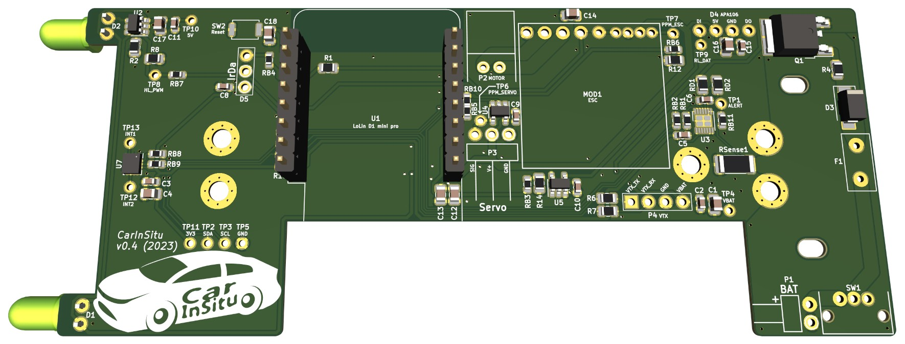

# CarInSitu PCB for RC car

This repository contains _KiCAD_ files related to RC car's PCB.

Its licensed under _GPLv3_.

↑ The above photo is of proto 1

## Features

 - ESP82xx MCU
 - External antenna through UFL connector (using Lolin D1 mini pro)
 - Front head light (High-efficiency LEDs)
 - RBG LED port (APA106/WS2812)
 - PPM-driven ESC for brushed motor (external module based)
 - PPM-driven steering
 - IR receiver
 - VTX port (UART)
 - IMU
 - Battery gauge

↑ The above screenshot is a 3D preview of v0.4

## Manufacturing note

The PCB is designed with "standard" isolation (≥ 6 mil) for the most part, except in the area of the IMU (U7) whose package is just under 6 mil.

There are overlapping components:
- R1, C12, C13 with U1: U1 is high enough for this to work
- RB5 with RB10: one pad is common so that they are not on board together

## Misc

Note: Feel free to contact [neomilium](https://github.com/neomilium) if you want to turn this into commercial product.
