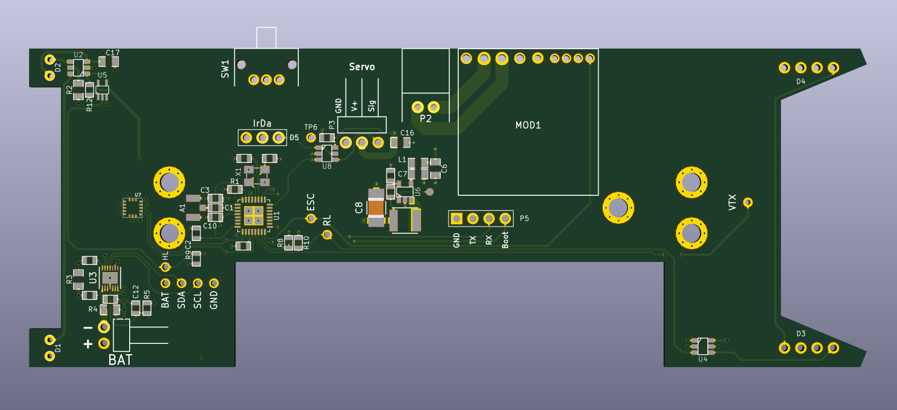

# CarInSitu PCB for RC car

This repository contains _KiCAD_ files related to RC car's PCB.

Its licensed under _GPLv3_.

Note: Feel free to contact [neomilium](https://github.com/neomilium) if you want to turn this into commercial product.
