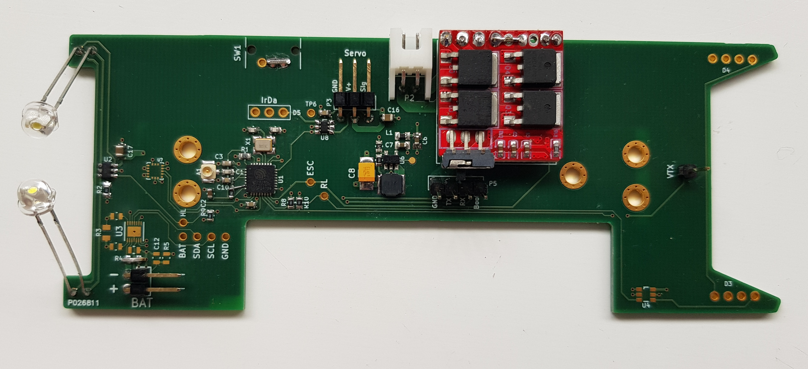

Carinsitu
=========

ToDo
----

 - Déplacement de P5
 - 5V+ GND avec VTX, alim sur trous traversants
 - Deplacement VTX à coté de U4
 - Bouton reset sur carte
 - Position irda -> Sous TP du enable U6
 - Déplacment ESC, vers couronne fixations droite
 - Irda, plié vers avant de la voiture (PIN1 en bas)
 - ~~LEDs des phares, tourner empreinte de 90degres (position inchangée)~~
 - Déplacement Wifi vers l'arrière (le plus possible et/ou au moins 2 à 3 mm)
 - Fix circuit de reset ESP
 - Déplacer U2 vers le haut pour permettre de bouger U7,
 - Déplacer U7 autant que possible vers l'avant
 - Ajouter une porte pour inverser signal PWM headlights
 - Ajouter ligne de TP avec alims (5V, 3V3)
